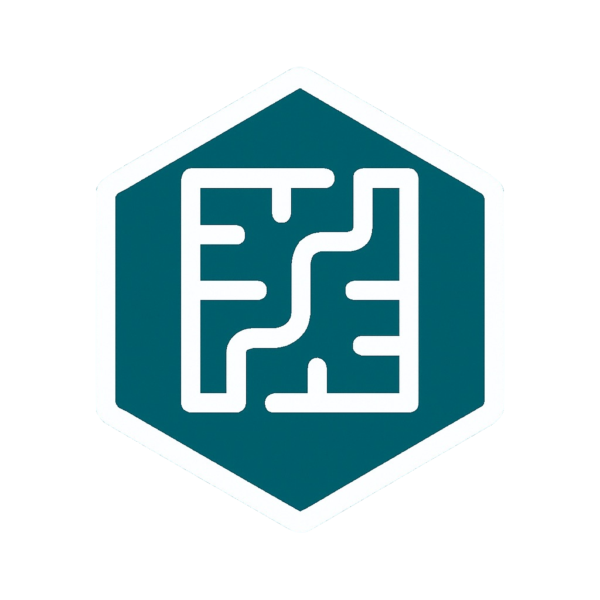

# AlgoHub

  
   

<!-- Will work once the repo is public -->

This repo collects common algorithms & data structures that are useful for interviews — each with

1. a **written and/or visual explanation**
2. a **python implementation**
3. **test cases**

## Contribution

### Guidelines

- **Coding Standards:**
  Follow clean and consistent coding practices. Use meaningful variable and function names.

- **Document Your Code:**
  Ensure all functions have clear and concise comments/description.

- **Test Your Changes:**
  While we understand that fully testing this library may be challenging, ensure your code works as intended before submitting. Focus on edge cases and confirm that your changes integrate smoothly with existing functionality.

- **Be Respectful**:
  Engage in discussions respectfully and constructively.

- **Follow The File Structure Template**: Each Algorithm should have its own file in **scr** with: A README based on the template and the python file. Parallel to that you should create another file inside tests with a python file torun the tests and a YAML file to store the tests cases.

### Bug Report
